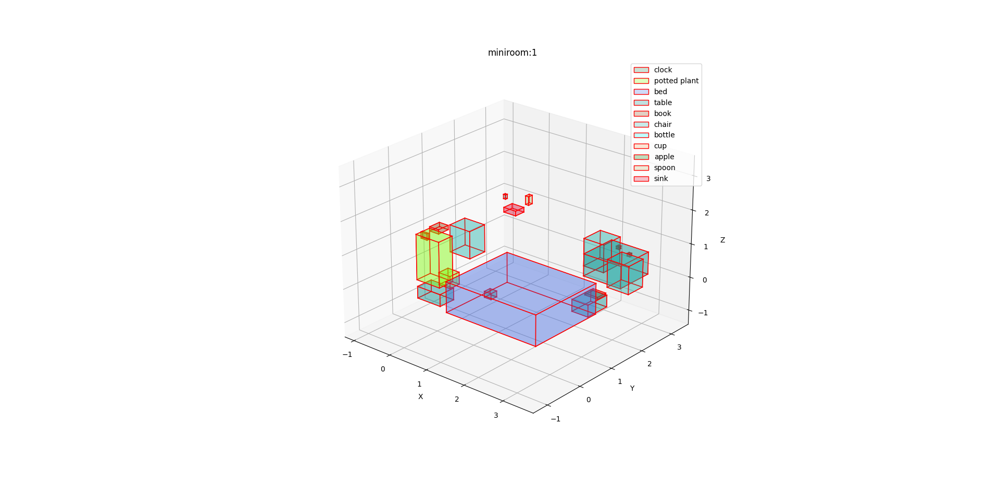
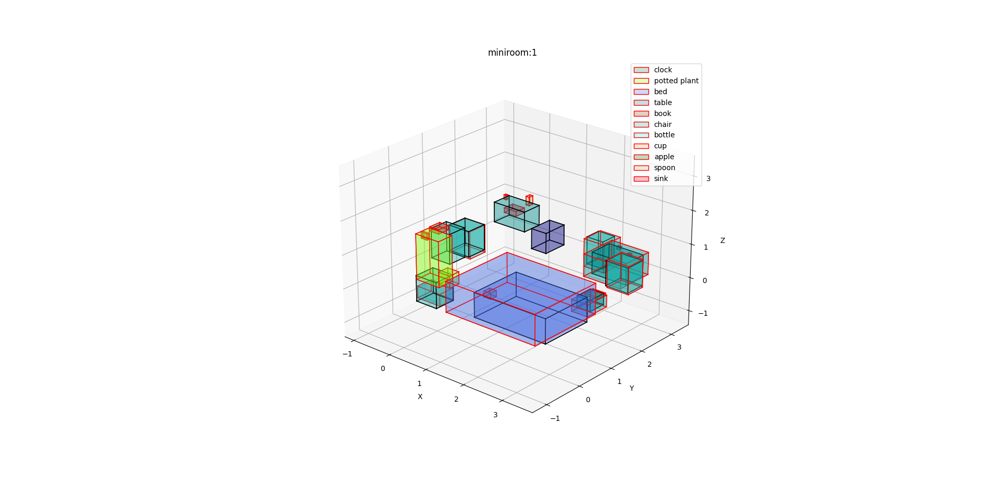

# ssu_map3d_visualization
This repository contains implementation of the visualisation tools mentioned in the scope of 
[Issue #35](https://github.com/qcr/benchbot/issues/35) of the [BenchBot Software Stack](https://github.com/qcr/benchbot).

Tools allow to visualise scene semantic map and overlay two semantic maps (e.g. ground-truth vs predicted) 
as illustrated in the pictures below:

| Ground-truth semantic map                                                                                        | Ground-truth semantic map vs semantic map built using [VoteNet](https://github.com/facebookresearch/votenet)                                                       |
|------------------------------------------------------------------------------------------------------------------|--------------------------------------------------------------------------------------------------------------------------------------------------------------------|
|  |  |

Repository structure:
```
ssu_map3d_visualization/
   - data/
   |   - miniroom_1.json          # ground-truth objects bounding boxes 
   |   - my_semantic_slam_0.json  # objects bounding boxes pridicted by VoteNet  
   - img/                         # example semantic map visualisations
   |   - miniroom1_ground_truth.png
   |   - miniroom1_ground_truth_vs_predicted.png
   - vis_tools/                   # python package with visualisation tools
   |   - __init__.py
   |   - tools.py
   - gt_map_vis.py                # example how to visualise one semantic map
   - gt_vs_pr_map_vis.py          # example how to overlay two semantic maps
```